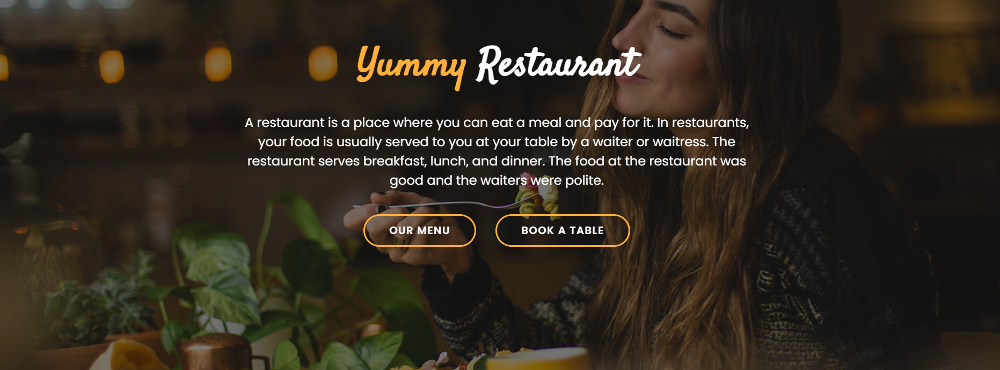
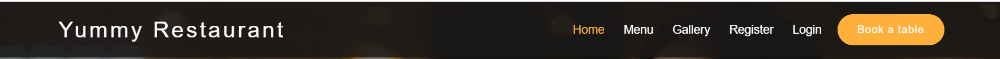
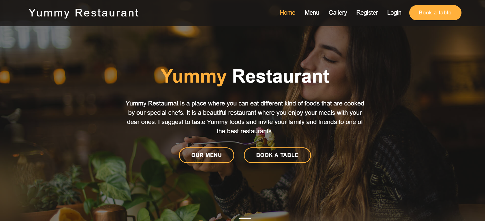
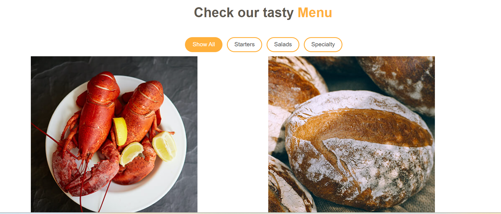
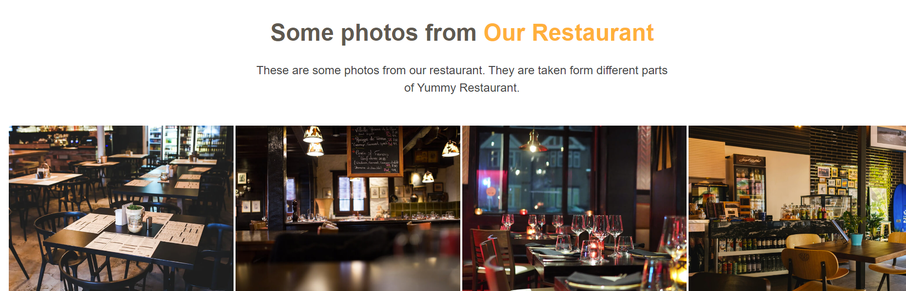
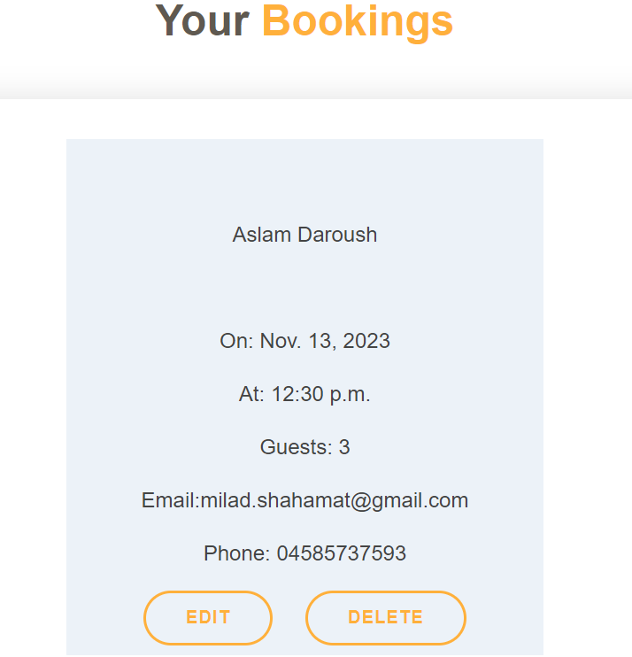
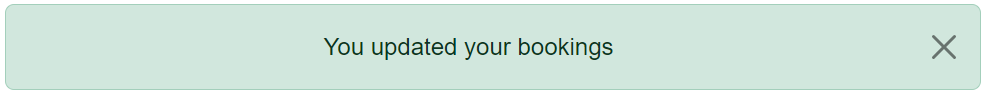

# **Yummy Restaurant**

This is my fourth project in [Code Institute](https://codeinstitute.net/de/) that is a for a Yummy fictional resturant. It is a very good place where people can go and eat the most delicious foods in Berlin, Germany. The customer can view the menu items and this webpage allows the user to sign in or sign up and book a table online and view the bookings to edit or delete them.

[View the live project here!](https://yummy-restaurant-webpage-6c0b2e074e4b.herokuapp.com/)

[View the Github repository](https://github.com/Saleha-m14/Restaurant-webpage)

# **Table of Contents**

- [**Yummy Restaurant**](#yummy-restaurant)
- [**Table of Contents**](#table-of-contents)
  - [Project Goals](#project-goals)
  - [User Stories](#user-stories)
  - [Features](#features)
    - [Navbar](#navbar)
    - [Home](#home)
    - [Menu](#menu)
    - [Gallery](#gallery)
    - [Footer](#footer)
    - [Account Signup and login](#account-signup-and-login)
    - [Booking](#booking)
    - [Managebooking](#managebooking)
    - [Messages](#messages)
  - [Frameworks, Libraries \& Tools](#frameworks-libraries--tools)
  - [Testing](#testing)
  - [Deployment](#deployment)
    - [Github Deployment](#github-deployment)
    - [Deploying with heroku](#deploying-with-heroku)
  - [Languages](#languages)
  - [Code](#code)
  - [Text](#text)
  - [Media](#media)
  - [Acknowledgements](#acknowledgements)

## Project Goals

The main goal for this project is to create a webpage for the customers of Yummy Restaurant that eligibles the user to view the restaurant webpage click on the book a table button and easily reserve a table. The user can view the bookings, edit and delete them.

## User Stories

- ### Administrator
  -  As a website admin I can log in to admin panel using the super user.
  -  As a website admin I can view the bookings and make changes to it.
  -  As a website admin I can edit or delete the bookings.

 -  ### First Time User
    -  As a first time user I want to view the Yummy Restaurant webpage and see information about resturant.
    -  As a first time user I can see the menu items to know which kinds of foods I can eat at this restaurant.
    -  As a first time user, I want to see some photos of restaurant.
    -  As a first time user I want to be able to find the relevant information to know how to contact with this restaurant.
    -  As a first time user I want to be able to book a table online bcause I want to be sure that there is an empty table for me.

 -  ### Frequent User
    - As a returning user I can create and log in it to see my bookings
    - As a returning user I can see my bookings.
    - As a reaturning user I can edit or delete bookings that I have made previously.

- ### Returning User

    -  As a returning user I want to be able to sign in and manage my bookings.
    -  As a returning user I want to be able to make changes to my current booking or cancel it.
    -  As a returning user I want to edit or delete my bookings.

- ### Agile Methodology

The user stories are added to project as [issues in the Github](https://github.com/Saleha-m14/Restaurant-webpage/issues) and are prioritzed using lables. The [Kanban Board](<https://github.com/users/Saleha-m14/projects/3>) is used to implement Agile in this project. This way I have devided all tasks and managed to complete the project.

-  ### Design
 I have used a bootstrap free template for this project that was created for a restaurant webpage.
 The template name is Deliscious and the author is bootstrapmade.com
  - Template Name: Delicious
  - Updated: Sep 18 2023 with Bootstrap v5.3.2
  - Template URL: <https://bootstrapmade.com/delicious-free-restaurant-bootstrap-theme/>
  - Author: BootstrapMade.com
  - License: <https://bootstrapmade.com/license/>
 [Bootstrap restaurant template](https://bootstrapmade.com/demo/Restaurantly/)

## Features

### Navbar
On the top of the page I have added a navbar menu with links that user can easily navigate to different pages

### Home
In the home page a short introductry test about Yummy Restaurant is written for the customers and the link to table booking page and menu items are added.

### Menu
In the menu section the list of the foods are added that the user can see what kinds of foods ares served in Yummy Restaurant.

### Gallery
Some photos of the restaurant differnt sections are added in the gallery section.

### Footer
The footer is in the bottom of the page with the link to social accounts.

### Account Signup and login
The user can go to signup and login pages to signup or login.

### Booking
The user can click on book a table button to go to the booking page and fill the form to reserve a table in Yummy Restaurant.

### Managebooking
When the user fills the booking form after submission the user is redirected to managebooking page to see the bookings to edit or delete.

### Messages
When the user login/logout/signup or submit or delete a form the messages are displaying to aware the user.

  - ### Future Features
    - As a future feature the user will be able to order food  from the menu items.
    - As a future feature I want to add some more foods to the menu.
    - As a future featura I want to add special offers for the customers.
  
## Frameworks, Libraries & Tools

  -  [**Heroku**](https://dashboard.heroku.com/apps) is used for deploying this project
- [**Github**](https://github.com/) is used to store the project.
- [**Codeanywhere**](https://codeanywhere.com/) is used as a development environment. 
- [**Django**](https://docs.djangoproject.com/) that is a python framework.
- [**Cloudinary**](https://cloudinary.com/)is used for media and static files.
- [**Database-URL**](https://pypi.org/project/dj-database-url/0.5.0/)is used to represent database settings
- [**Gunicorn**](https://pypi.org/project/gunicorn/20.1.0/) is used to run Django on heroku.
- [**Psycopg2**](https://pypi.org/project/psycopg2/2.9.3/) to connect Postgre SQL
- [**Bootstrap**](https://getbootstrap.com/) used for the frontend
- [**allauth**](https://docs.allauth.org/en/latest/release-notes/recent.html)
- [**Am I responsive**](https://ui.dev/amiresponsive) is used to check if the website is responsive to different devices.
- [**Github issues & Kennan Board**](https://github.com/users/Saleha-m14/projects/3/views/1) is used to track the progress of the project.

## Testing

   - ### Bugs
     - #### Fixed Bugs

| Bug | Solution | Status |
| ---| ---| ---|
|The Success and error messages were not displaying | I had forgotten to add an html template for displaing the message. The issue were solved by adding the HTML template for messages. | Fixed |
|There was not any success or error message after booking a table | I removed the message HTML template from booking page and added to manage bookings page because the user was redirected to managebooking after reservation. | Fixed |
| When the user filled in the booking form and clicked submit button nothing was happening due to an error. | I removed the validate.js that was comming from bootrstrap template that I used and the issue were solved. | Fixed |
| I was not able to log in to the admin panel using my superuser data. | I created a new superuser  after migrating to the Elephant SQL Database. | Fixed |
| The navbar links were not working. | I changed the href and added the url to open the link. | Fixed |
| The images were not showing when openening the project on a browser. | Edited the image sources to display in the djano project. | Fixed |
| User can book a table with out login or signup. | Added the djanog authentication to authenticate user and allow the user to book a table only if the user is logged in. | Fixed |
| The user was not able to view the previous bookings and edit or delete the bookings. | Added the managebooking, changebooking and deletebooking to enable user to edit the bookings.| Fixed |

- #### Remaining Bugs
  There is not any known bugs in my project.

  - ### Testing User Stories
    -  ### First Time User
       -  As a first time user I want to view the Yummy Restaurant webpage and see information about resturant.
          -  When the user opens the Yummy Restaurant webpage the user can find relevant information about the restaurant and see the images.
       -  As a first time user I can see the menu items to know which kinds of foods I can eat at this restaurant.
          -  The menu is added to the website the user can view the menu and see what kind of foods are served in this restaurant.
       -  As a first time user, I want to see some photos of restaurant.
          -  Some photos of the restaurant is added to the bottom of the site above nav links
       -  As a first time user I want to be able to book a table online bcause I want to be sure that there is an empty table for me.
          -  The user can find the link to the booking page and reserve a table online.
    
- ### Frequent User

    - As a returning user I can create and log in it to see my bookings.
      - The user can login and view the bookings and edit or delete the bookings.
    - As a returning user I can see my bookings.
      - The user can see the bookings on managebooking.
    - As a reaturning user I can edit or delete bookings that I have made previously.
      - The user can edit or delete booking.

- ### Returning User

  - As a returning user I want to be able to sign in and manage my bookings.
    - The user can sign in and mangae all the bookings that he/she has made.
  - As a returning user I want to be able to make changes to my current booking or cancel it.
    - The user can change the bookings.
  - As a returning user I want to edit or delete my bookings.
    - The user can delete the bookings easily.

## Deployment

### Github Deployment

    -  Login to your github account and navigate to your repositories and click on New.
    -  Select a template(the Code Institute full template is used for this project).[Code-Institute-Org/python-essentials-template](https://github.com/Code-Institute-Org/p3-template)
    -  Write a name for your repository
    -  Select public
    -  Click on create to create your repository.
    -  Copy the link of your repository
    -  log in to your cloudinary using github
    -  click on crete new workspace and paste the github url.
    -  Run the commands first "git add .", then "git commit -m "commit message" and finally "git push" to push the files to github.

### Deploying with heroku

This project is deployed using [Heroku](https://id.heroku.com/) and following the instruction of deployment video of Course Institue. These are the deployment steps:

    1. Open Heroku and click on "Create New App".
    2. Write your app name and select region. You should give your app a unique name.
    3. On the new page click on "settings" and select Config Var and add the below keys:
        -  key: PORT & value 8000
        -  Add key: DATABASE_URL, this should have been created automatically by Heroku.
        -  Add key: CLOUDINARY_URL and the value as your cloudinary API Environment variable e.g.
        -  Add key: SECRET_KEY and the value as a complex string which will be used to provide    cryptographic signing.

    4. Click on "Deploy" tab.
    5. Select "Github" as deployment method.
    6. Search for your repository name and click connect.
    7. Make sure that "main" branch is selected and click on "Enable Automatic Deploys" then, click on "Deploy Branch".
    8.  When your project is deployed you can open it simply by clicking "View".

## Languages

    -  Python
    -  JavaScript
    -  HTML5
    -  CSS3

## Code

    - [Deliscious](https://bootstrapmade.com/restaurantly-restaurant-template/) theme was the Boostrap theme used in the project.
    - [Django Documenation](https://docs.djangoproject.com/en/4.2/) was used to provide examples of code solutions and Django functionality.
    - [Bootstrap Documenation](https://getbootstrap.com/docs/4.1/getting-started/introduction/) was used to provide examples of Bootstrap functionality and building blocks.
    - Code Institute walkthrough as inspiration and code examples, the code institute walkthroughs "Hello Django" and "I Think Therefore I Blog" was used.

## Text
   The texts are written by author.

## Media 
    The images comes from [bootstrp deliscious theme.](https://bootstrapmade.com/restaurantly-restaurant-template/)

## Acknowledgements

    The tutor support team at Code Institute for their support.
    My Code Institute Mentor for feedback and suggestions.
